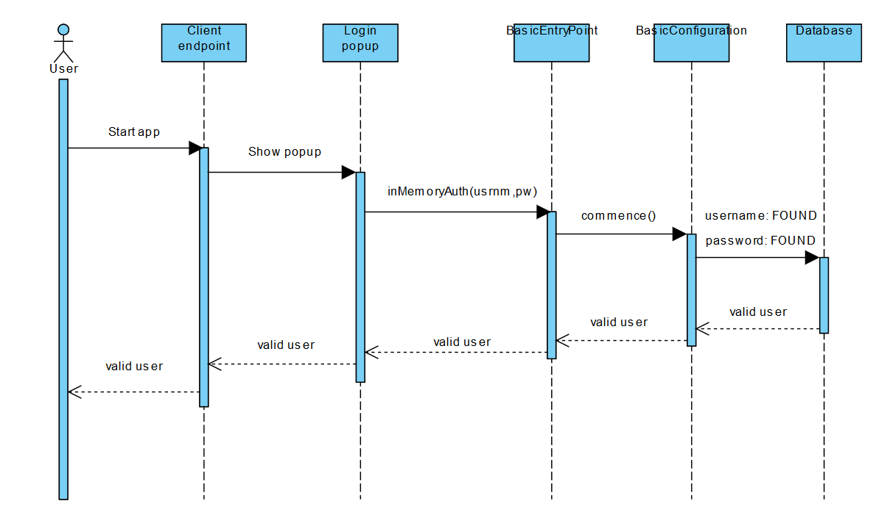
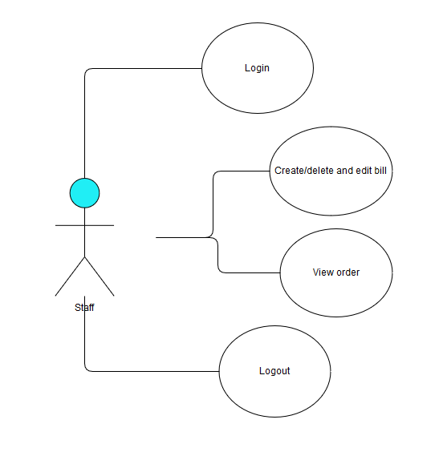
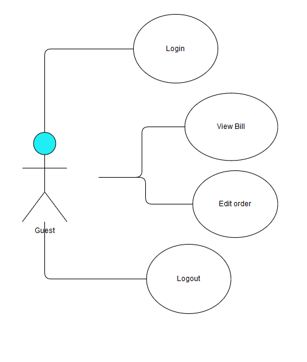

# No hurry, no worry!
## Alkalmazás rövid ismertetése:

Biztos veled is előfordult már, hogy étteremben vagy bárban a pincér már fut hozzád, mikor még Te a menü első oldalánál tartasz és így kényszerből rendeltél..
Ez mostantól nem fordulhat elő, ha a vendéglátóegységek átt állnak erre a rendszerre!
Ugyan is az asztalodhoz beülve, elektronikus eszközön keresztül Te adod le a rendelést, akkor amikor akarod és olyan megjegyzéssel amivel akarod.
Csak egy gombnyomással, már jelezheted is a pincérnek a kívént rendelésed és az automatizált funkciók miatt már rögtön készítik is a kívánt ételt és (vagy) italodat.
Ha végeztél a rendelésed elfogyasztásával és rendezted a számlát, nincs más dolgod csak jóllakottan távozni!
Dolgozó kollégánk az asztalhoz siet és az asztal nullázásával már fogadják is a következő vendéget!

## Az alkalmazás funkcionális követelményei:

* Vendégek: 
  - Amit csinálhatnak:
    - Hozzáférnek az étlap és itallaphoz.
    - Rendelést adhatnak le.
    - Speciális igényeiket (ételérzékenység) megjegyzésben jelezhetik.
    - Panasszal élhetnek fizetésig.
    - Fizetési szándékukat jelezhetik a pincér felé
  - Amit nem csinálhatnak:
    - Nem minden funkciót érnek el. 
    - Nincs szükség regisztrálásra, ezért a személyükről adatot nem fogunk tárolni. 
    - Nem az alkalmazáson keresztül történik a fizetés.
    
### Dolgozók:

* Pincérek:
  - Regisztrálni kell.
  - Generált kódjuk lesz amivel azonosítani tudjuk őket.
  - Látják a rendelést, panaszt, rendelés elkészültét, fizetési szándékot.
  - Nullázhatják fizetés után az asztal adatait (asztalazonosítót nem).
* Szakácsok:
  - Látják az asztal rendelését, megjegyzéseket.
  - Étel/ital elkészülését jelezheti a pincérnek.
* Az asztaloknak külön azonosítójuk van.
* A dolgozók módosíthatják az étlap/itallapot, hogy egy adott étel/ital elérhető-e vagy sem.

## Az alkalmazás nem funkcionális követelményei:

* Az alkalmazásnak átláthatónak és könnyen kezelhetőnek kell lennie.
* Az alkalmazásnak az adatokat biztonságosan kell kezelnie és tárolnia, kiváltképpen az érzékeny hitelesítő adatokat, amelyek az autentikációhoz szükségesek.
* Az alkalmazásnak gyors válaszidejűnek kell lennie.
* Az alkalmazásnak szinte folyamatosan, minimális rendszerleállásokkal kell működnie a problémák elkerülése miatt.
* A rendszer adatbázisának jól szervezettnek kell lennie, a dinamikusságot elősegítve.

## Szakterületi fogalomjegyzék:

* Étel / ital: felhasználók rendelhetik, dolgozók módosithatják az elérhetőségét.
* Rendelés: Ételek és italok csoportjának kérvényezése az asztalhoz, a rendelés során látszik a végösszeg, és az esetleges alapáron felüli költség.
* Panasz: Amig a vendég nem távozik panaszt tud tenni a pultos/pincér felé, ő pedig továbbithatja ezt az üzletvezetőnek.
* Távozási szándék bejelentése: Ha végzett a vendég, jelezheti a pincéreknek egy gombbal, hogy fizetni és távozni szeretne.

## Szerepkörök:

* (vendég) felhasználó: általános felhasználó, akinek lehetősége van arra, hogy rendelést leadjon az asztalhoz. Értékelheti az ételt, megjegyzést fűzhet ételhez, dolgozóhoz.
* pincér / pultos : olyan felhasználó, aki betekintést nyer az összes asztal rendeléseibe, és nullázni tudja az asztalt.
* üzletvezető: olyan felhasználó, akinek joga van a rendelésekhez fűzött megjegyzéseket módositani, valamint az azokat író felhasználókat moderálni. Egy bejelentkezett felhasználót beállithat dolgozónak, létszámbővités esetén
* rendszeradminisztrátor: olyan felhasználó, akinek joga van pultosokat, pincéreket, üzletvezetőket létrehoznia, moderátori jogokkal bír, valamint természetesen az egyszerű felhasználó jogai is megilletik


## Fejlesztői környezet

A backend-hez használt technológiák

A fejlesztés során a Spring keretrendszer (legfrissebb stabil 2.2.0-ás verziójának) segítségével készítünk el egy Java (8) alapú alkalmazást, melynek menedzselésének és build folyamatának automatizálása során a Mavent hívjuk segítségül. A fejlesztés során az Apache NetBeans (11) integrált fejlesztői környezetet használjuk. A Spring Boot függőségek közül az alábbiakat vesszük igénybe:

   * Spring Data JPA (Spring Data-át és Hibernate-et használva a Java Persistence API segítségével SQL-ben tárolja az adatokat),
   * Spring Boot DevTools (gyors alkalmazás újraindításokat, valós idejű újratöltést és különböző konfigurációs lehetőségeket biztosít),
   * H2 Database (gyors memóriában tárolt adatbázist biztosít, ami támogatja a JDBC API-t),
   * Lombok (annotációkat tartalmazó könyvtár a kód elburjánzás megelőzésének érdekében),
   * Spring Web (támogatja a webes alkalmazások készítését, kiváltképp a REST alapokon mozgókét SPRING MVC felhasználásával),
   * Spring Security (testreszabható autentikációs és elérés-kezelő keretrendszer).

## Adatbázis terv (UML)
.png

## Könyvtárstuktúra

### Gyökérkönyvtár

* **.git mappa** *(verziókezelő számára szükséges fájlokat és almappákat tartalmaz)*
* **.mvn mappa** *(a Maven build rendszer számára szükséges fájlokat és almappákat tartalmaz)*
* **src mappa** *(a program forráskódját, valamint néhány a fordításhoz és az egyes Spring Boot komponensek kielégítő működéséhez információt tároló konfigurációs fájlt tartalmazó mappa)*
   * **main mappa** *(a forráskód lényegi része, az objektumok implementációja)*
      * **java mappa** *(a mappa tartalmazza a forráskód package-ek szerint tagolt mappaszerkezetét)*
         * **hu mappa** *(a hu package-et jelképező mappa)*
            * **elte mappa** *(az elte package-et jelképező mappa)*
               * **hurryworry mappa** *(a worry package-t jelképező mappa)*
                  * **controllers mappa** *(a mappa tartalmazza azokat a forrásfájlokat, amelyek az egyes entitásokat kezelik a REST alapú alkalmazás elvei szerint, különböző mapping-eket hajthatunk végre velük)*
                  * **entities mappa** *(a mappa tartalmazza azokat a forrásfájlokat, amelyek megvalósítják az egyes entitásokat)*
                  * **repositories mappa** *(a mappa tartalmazza azokat a forrásfájlokat, amelyek az egyes entitások számára lehetővé teszik a CRUD hívásokat)*
                  * **security mappa** *(a mappa tartamazza az autentikációhoz szükséges forrásfájlokat)*
                  * **HurryworryApplication.java** *(az alkalmazás belépési pontját tartalmazó forrásfájl)*
      * **resources mappa** *(a mappa tartalmazza a programhoz szükséges "nyersanyagokat", azokat a fájlokat, amelyek nem nevezhetőek kifejezetten forráskódnak, mégis elengedhetetlenek a kielégítő működéshez)*
         * **static mappa**
         * **templates mappa** 
         * **application.properties** *(tartalmazza az alkalmazás egyes függőségeinek értékadás-szerű utasításokkal való konfigurációját)*
         * **import.sql** *(a H2 Database számára szükséges SQL forrásfájl, amely tartalmazza azokat az utasításokat, amelyeket az adatbázisban a program futása előtt el kell végezni)*
         * **admin.png** 
         * **Staff.png**
         * **Guest.png**
         * **szekvencial.png**
* **.gitignore** *(a fájl tartalmazza azokat a fájlokat (vagy mintákat), amelyeket a verziókezelő rendszernek figyelmen kívül kell hagynia)*
* **mvnw és mwnw.cmd** *(a Maven-Wrapper-hez szükségesek, letöltik a megfelelő Maven verziót (ha nem találja), lehetővé teszik a Maven futtatását akkor is, ha azt nem találják a számítógépen - a mvnw a Linux rendszereken, a mvnw.cmd pedig a Windows rendszerek használható)*
* **pom.xml** *(a Maven által használt konfigurációs fájl, amely információkat tartalmaz a projektről és annak felépítéséről, kezdve annak nevétől, a package-ek strúktúráján át az egyes függőségek leírásáig minden fontos adattal a build folyamatról és az egyes pluginokról)*
* **README.md** *(a verziókövető rendszer (pl. Git) által alkalmazott szöveges fájl, mely arra szolgál, hogy a projekt iránt érdeklődők tájékozódhassanak azokról a fontos információkról, amelyeket a fejlesztők megosztanának velük (például a könyvtárstruktúra részletes leírását, remélem mindenki elolvassa idáig haha))*

## Végpont tervek

### Egyszerű végpontok

  * ```.../bill```
  * ```.../order```
  * ```.../user```
  * ```.../com```
 
### H2 Adatbázis végpontja

  * ```.../h2-console```
  
### Hiba végpont

  * ```.../error```
  
### Végpontok működése
Bemutatás szekvenciáldiagram formájában. Minden eddigi végpont így néz ki.


### Szerepkörök és hozzáférési jogok
Use case diagrammok segítségével mutatjuk be, hogy egyes jogokkal rendelkező felhasználók mikhez férnek hozzá.





